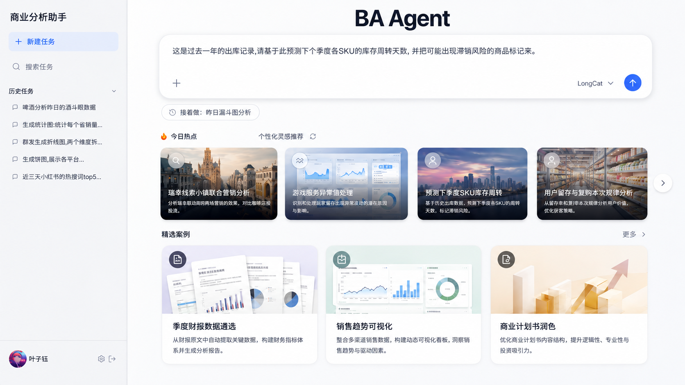
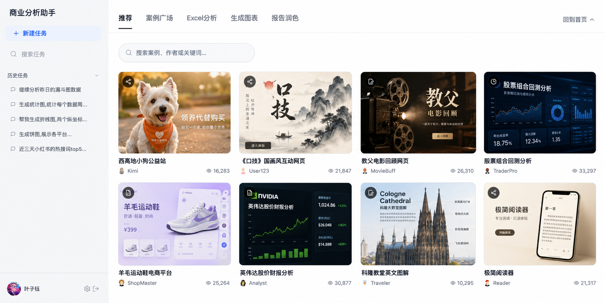
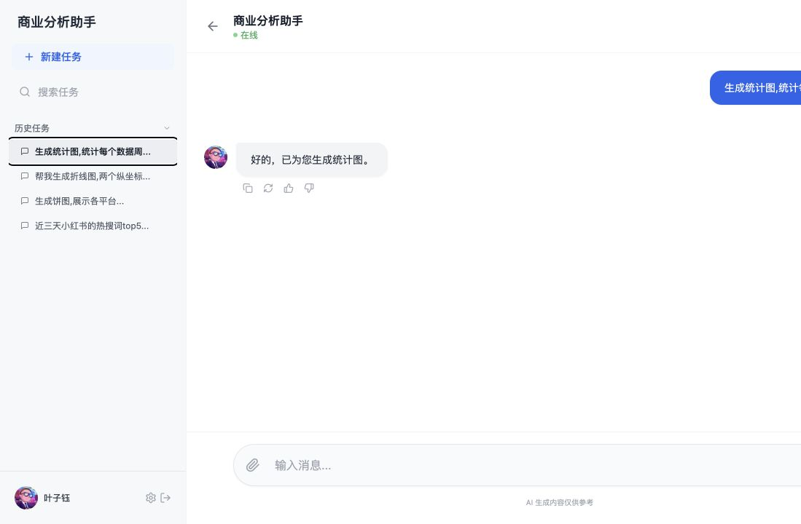
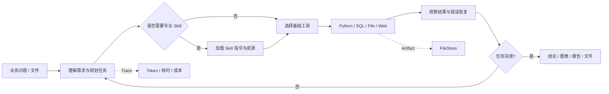

# BA-Agent

> Business Analysis Agent：面向业务分析场景的 AI Native 工作台，将自然语言问题转化为可执行、可追踪、可交付的分析任务。

[](https://www.python.org/)
[](https://fastapi.tiangolo.com/)
[](https://langchain-ai.github.io/langgraph/)
[](https://react.dev/)
[](https://vite.dev/)

## 运行效果

### AI 分析工作台



首页聚合自然语言任务输入、历史任务、热点洞察、个性化灵感与精选案例，让用户从业务问题直接进入分析流程。

### 案例广场



案例广场按 Excel 分析、图表生成、报告润色等任务分类展示可复用场景，帮助用户快速理解产品能力边界。

## 项目简介

业务分析往往不止是一次 SQL 查询：用户需要理解指标口径、读取文件、清洗数据、选择分析方法、解释异常、生成图表，并把结果整理成报告。

BA-Agent 将这条工作链路收敛到一个对话式入口，由 Agent 根据任务动态规划步骤、激活专业 Skill、调用分析工具并沉淀执行结果。

核心场景：

- 异动检测与解释：识别指标波动，结合历史数据判断异常程度；
- 归因分析：按地区、品类、渠道等维度计算变化贡献；
- 数据处理：读取 CSV、Excel、JSON，执行 Python 或只读 SQL；
- 数据可视化：推荐图表类型并生成 ECharts 配置；
- 报告生成：输出日报、周报、月报或自定义分析报告；
- 过程追踪：记录 LLM、工具、Skill、Token、耗时与错误链路。

## 从需求到产品

| 阶段 | 核心判断 | 产品/工程落点 |
| --- | --- | --- |
| 需求发现 | 分析效率低的根因是跨工具编排和上下文丢失 | 用自然语言承接完整任务，而非只做 NL2SQL |
| 产品定义 | 用户需要结论，也需要图表、文件和证据链 | 对话工作台 + Artifact + Trace |
| 方案设计 | 分析路径不固定，但安全边界必须确定 | LangGraph Agent Loop + 确定性工具校验 |
| 能力扩展 | 不同分析方法需要复用，不能持续膨胀 Prompt | 渐进式 Skills 系统 |
| 工程落地 | 长上下文、执行风险和线上调试是主要难点 | Context、Pipeline、Sandbox、Monitoring |

产品边界：BA-Agent 是分析协作者，不替代业务口径治理，也不应在缺少人工确认时直接执行高风险经营决策。

## 产品体验

### 对话工作区



同一个任务可以持续追问，并通过 `conversation_id` 复用 LangGraph Checkpointer 中的历史状态。

## 一次分析请求如何执行



1. FastAPI 接收请求并创建或恢复对话；
2. `ContextCoordinator` 清理大文件内容、整理历史消息并注入系统提示；
3. LangGraph Agent 判断直接回答、调用工具或激活 Skill；
4. Tool Node 执行受控分析，Pipeline 统一结果、超时和产物存储；
5. Agent 根据工具结果继续迭代，直到返回完成响应；
6. Monitoring 保存完整调用链及性能数据。

## 技术架构

```mermaid
flowchart LR
    subgraph EXPERIENCE["① 体验层 · Experience"]
        direction TB
        WEB["💬 Web 工作台<br/>React · Vite"]
        CLIENT["🔌 API / Python Client"]
    end

    subgraph PLATFORM["② 服务治理层 · Platform"]
        direction TB
        API["FastAPI Gateway"]
        GUARD["🔐 JWT · RBAC<br/>Rate Limit · Error Handling"]
        SERVICE["BAAgentService"]
        API --> GUARD --> SERVICE
    end

    subgraph RUNTIME["③ Agent 智能核心 · Runtime"]
        direction TB
        CONTEXT["ContextCoordinator<br/>消息准备 · 文件摘要 · 上下文压缩"]
        AGENT["◆ LangGraph Agent Loop<br/>Analyze → Plan → Execute → Observe"]
        SKILLS["🧩 Skill Registry<br/>按需加载专业能力"]
        MEMORY["🧠 Checkpointer & Memory<br/>会话状态 · 混合检索"]

        CONTEXT --> AGENT
        SKILLS -. "能力注入" .-> AGENT
        MEMORY <--> AGENT
    end

    subgraph EXECUTION["④ 工具执行层 · Execution"]
        direction TB
        PIPELINE["Tool Pipeline<br/>统一输出 · 超时 · 缓存 · Token"]
        TOOLBOX["🛠 Tool Hub<br/>File · SQL · Web · Vector"]
        SANDBOX["📦 Docker Sandbox<br/>Python · Command · AST Guard"]

        PIPELINE --> TOOLBOX
        PIPELINE --> SANDBOX
    end

    subgraph FOUNDATION["⑤ 数据与运营层 · Data & Ops"]
        direction TB
        STORE["🗂 FileStore<br/>Upload · Code · Chart · Report"]
        TRACE["🔭 Execution Trace<br/>Agent · LLM · Tool · Skill Span"]
        METRICS["📈 Metrics<br/>Token · Latency · Success · Cost"]

        TRACE --> METRICS
    end

    WEB --> API
    CLIENT --> API
    SERVICE --> CONTEXT
    AGENT ==> PIPELINE
    TOOLBOX --> STORE
    SANDBOX --> STORE
    AGENT -. "运行事件" .-> TRACE
    PIPELINE -. "执行数据" .-> TRACE

    class WEB,CLIENT experience
    class API,GUARD,SERVICE platform
    class CONTEXT,SKILLS,MEMORY runtimeSoft
    class AGENT runtimeCore
    class PIPELINE,TOOLBOX,SANDBOX execution
    class STORE,TRACE,METRICS foundation

    classDef experience fill:#EAF4FF,stroke:#4C8EDA,color:#102A43,stroke-width:1.5px
    classDef platform fill:#EAFBF3,stroke:#38A169,color:#173F2A,stroke-width:1.5px
    classDef runtimeSoft fill:#F3EEFF,stroke:#8B6FD4,color:#34245F,stroke-width:1.5px
    classDef runtimeCore fill:#6D5BD0,stroke:#4C3DAA,color:#FFFFFF,stroke-width:2.5px
    classDef execution fill:#FFF5E5,stroke:#D69E2E,color:#513B12,stroke-width:1.5px
    classDef foundation fill:#FFF0F5,stroke:#D06292,color:#57233A,stroke-width:1.5px

    style EXPERIENCE fill:#F8FBFF,stroke:#B8D6F2,stroke-width:1px
    style PLATFORM fill:#F6FCF9,stroke:#B7E4CA,stroke-width:1px
    style RUNTIME fill:#FAF8FF,stroke:#D7CBF2,stroke-width:1px
    style EXECUTION fill:#FFFBF3,stroke:#F1D49A,stroke-width:1px
    style FOUNDATION fill:#FFF8FA,stroke:#EDC4D5,stroke-width:1px
```



实线表示用户请求的主执行链路，虚线表示能力注入与可观测数据旁路；中心的 LangGraph Agent 负责决策，Pipeline 和确定性工具负责受控执行。

### 核心组件

| 组件 | 技术 | 职责 |
| --- | --- | --- |
| Agent | LangGraph + LangChain Core | 状态管理、推理循环、Tool Calling、结构化响应 |
| API | FastAPI + Pydantic | 对话、文件、Skills、认证和监控接口 |
| Context | ContextCoordinator + ContextManager | 消息准备、文件摘要、上下文压缩 |
| Skills | YAML Frontmatter + Registry/Activator | 专业能力注册、匹配和按需加载 |
| Pipeline | ToolExecutionResult | 统一输出、超时、缓存、Token 与 Artifact |
| Analysis | pandas、NumPy、SciPy、SQLAlchemy | 数据处理、统计分析与数据库查询 |
| Sandbox | Docker + AST 校验 | 隔离 Python/命令执行并限制危险操作 |
| Storage | FileStore | 管理上传、代码、图表、报告、缓存和临时文件 |
| Monitoring | Trace + Span + Metrics | 记录调用链、耗时、Token、错误与成本估算 |
| Frontend | React + Vite + Tailwind CSS | 首页、历史任务、案例和对话工作区 |

## AI Native 工程设计

### 自定义 Agent Loop

仓库使用自定义 `StateGraph` 实现 `Analyze → Plan → Execute → Observe` 循环，同时兼容模型原生 `tool_calls` 与结构化 JSON 工具调用。

代码：[`backend/agents/agent.py`](backend/agents/agent.py)

### 渐进式 Skills

Skill Loader 首先只读取 YAML Frontmatter；任务需要时才加载完整 `SKILL.md` 和相关资源，降低无关指令对上下文的占用。

内置 Skills：

- [`anomaly_detection`](skills/anomaly_detection/)：统计异常和历史对比；
- [`attribution`](skills/attribution/)：贡献度、相关性与维度下钻；
- [`visualization`](skills/visualization/)：图表推荐和 ECharts 配置；
- [`report_gen`](skills/report_gen/)：周期性与自定义报告。

代码：[`backend/skills/`](backend/skills/)

### 上下文与记忆

- LangGraph Checkpointer 保存对话状态；
- ContextManager 负责文件清理、摘要和压缩；
- ContextCoordinator 提供统一消息准备入口；
- Memory 模块支持索引、检索与 Memory Flush。

代码：[`backend/core/`](backend/core/)、[`backend/memory/`](backend/memory/)

### 受控工具执行

Python 工具使用危险模式检查、AST Import 白名单和 Docker 资源隔离；SQL 工具限制只读查询；FileStore 校验路径、扩展名和文件大小。

代码：[`tools/python_sandbox.py`](tools/python_sandbox.py)、[`tools/database.py`](tools/database.py)、[`backend/filestore/security.py`](backend/filestore/security.py)

### 可观测性

ExecutionTracer 使用父子 Span 表达 Agent、LLM、工具、Skill 和上下文压缩链路；MetricsCollector 汇总 Token、耗时、成功率和估算成本。

代码：[`backend/monitoring/`](backend/monitoring/)

## 核心工具

| 工具 | 作用 | 关键约束 |
| --- | --- | --- |
| `execute_command` | 执行受控命令 | 白名单与 Docker 隔离 |
| `run_python` | 运行数据分析代码 | AST 校验、Import 白名单、超时 |
| `web_search` / `web_reader` | 搜索与读取网页 | MCP 模式与输出封装 |
| `file_reader` / `file_write` | 读取和生成分析文件 | 路径与类型校验 |
| `query_database` | 查询业务数据库 | 参数化、只读限制、连接清理 |
| `vector_search` | 检索指标和知识 | Vector + 本地回退 |
| `memory_search_v2` | 检索长期记忆 | FTS5 + Vector 混合搜索 |
| `activate_skill` | 激活专业 Skill | 权限与上下文修饰器 |

## 快速开始

### 环境要求

- Python 3.12；
- Node.js 18+；
- Docker Desktop（Python/命令沙盒需要）；
- Anthropic、OpenAI、Google 或智谱中的至少一个模型 API Key。

### 1. 安装后端

```bash
git clone https://github.com/lucky-Coconutye/Cocoye-BA-Agent.git
cd Cocoye-BA-Agent

python3.12 -m venv .venv
source .venv/bin/activate
python -m pip install -r requirements.txt

cp .env.example .env
```

在 `.env` 中配置模型，例如：

```dotenv
BA_DEFAULT_MODEL=glm-4
ZHIPUAI_API_KEY=your_key
```

### 2. 启动 API

```bash
python -m uvicorn backend.api.main:app \
  --host 127.0.0.1 \
  --port 8000 \
  --reload
```

```bash
curl http://127.0.0.1:8000/api/v1/health
```

- OpenAPI：<http://127.0.0.1:8000/docs>
- Health：<http://127.0.0.1:8000/api/v1/health>

### 3. 启动前端

```bash
cd coco-frontend
npm ci
npm run dev
```

访问 <http://127.0.0.1:8080>。Vite 会将 `/api` 代理到后端 `8000` 端口。

### 4. 构建与测试

```bash
# 后端测试
source .venv/bin/activate
pytest

# 前端生产构建
cd coco-frontend
npm run build
```

当前仓库未包含 ESLint 配置文件，因此 `npm run lint` 尚不能作为有效校验命令。

### Docker Compose

```bash
docker compose up --build
```

Compose 文件包含 API、PostgreSQL 和 ClickHouse；实际使用 Python 沙盒时还需要可访问的 Docker daemon。

## API 入口

| Endpoint | 作用 | 鉴权 |
| --- | --- | --- |
| `GET /api/v1/health` | 健康检查 | 否 |
| `POST /api/v1/auth/login` | 获取 JWT | 否 |
| `POST /api/v1/chat` | 前端简易对话 | 否 |
| `POST /api/v1/agent/query` | 完整 Agent 查询 | 当前路由未强制 JWT |
| `/api/v1/files/*` | 文件上传、下载与删除 | 是 |
| `/api/v1/skills/*` | Skill 查询与管理 | 是 |
| `/api/v1/monitoring/*` | Trace 和 Metrics | 是 |

```bash
curl -X POST http://127.0.0.1:8000/api/v1/chat \
  -H 'Content-Type: application/json' \
  -d '{"message":"分析最近 30 天 GMV 异动并给出可能原因"}'
```

真实 Agent 响应需要有效模型凭证；健康检查、OpenAPI 和前端静态页面不需要。

## 项目结构

```text
.
├── backend/
│   ├── agents/            # LangGraph Agent
│   ├── api/               # FastAPI、路由与认证
│   ├── core/              # 上下文管理
│   ├── filestore/         # 文件与 Artifact
│   ├── memory/            # 记忆、索引与检索
│   ├── monitoring/        # Trace 与 Metrics
│   ├── pipeline/          # 工具输出、超时和缓存
│   └── skills/            # Skill 加载与激活
├── coco-frontend/         # React + Vite 前端
├── skills/                # 业务 Skills
├── tools/                 # Agent 工具
├── tests/                 # 单元与集成测试
├── docs/                  # 架构与开发文档
├── config/                # 应用配置
└── docker-compose.yml     # 本地服务编排
```

## 当前状态与边界

仓库已经具备 Agent、Skills、上下文、工具、FileStore、监控 API 和产品前端等核心模块。当前仍需继续完善：

- 前端上传、知识库和 Skill 管理与后端 API 的完整联调；
- 流式输出、任务取消和失败恢复；
- 会话、Trace 与 Artifact 的生产级持久化；
- Prompt/Skill 版本管理和 Golden Dataset 自动评测；
- 多租户隔离、审计、密钥托管与细粒度权限；
- 统一代码、OpenAPI 和文档中的版本来源。

## 文档

- [产品与文档导航](docs/README.md)
- [技术架构](docs/architecture.md)
- [API 设计](docs/api.md)
- [上下文管理](docs/context-management.md)
- [响应流转](docs/response-flow.md)
- [Skills 开发](docs/skills.md)
- [监控设计](docs/monitoring.md)
- [开发指南](docs/development.md)

## License

MIT License
